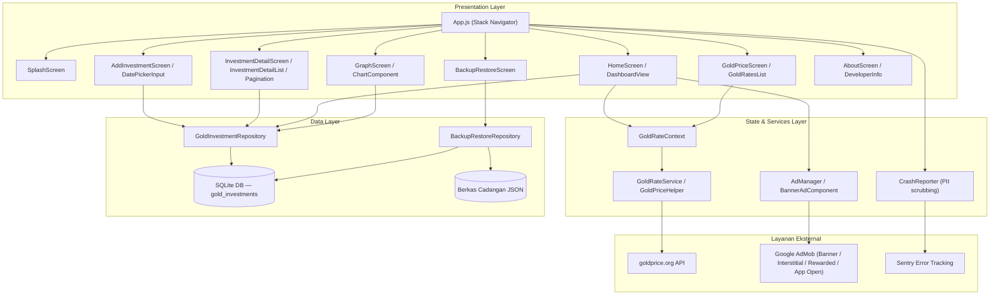
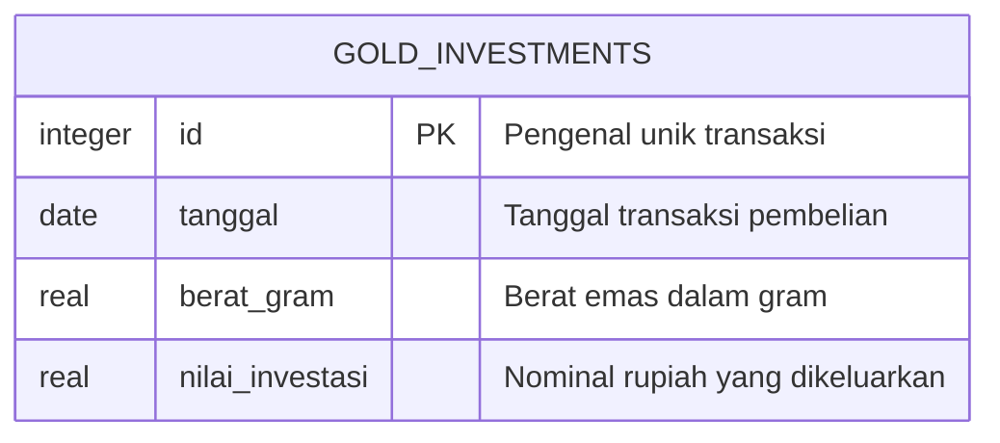

# PRD — Project Requirements Document

## 1. Overview

**Catat Emas** (repository `farisi55/GoldInvestmentApp`) adalah aplikasi *mobile* untuk mencatat dan mengelola portofolio investasi emas pribadi. Aplikasi ini sudah dibangun dengan pendekatan *offline-first* — seluruh data transaksi tersimpan di perangkat pengguna, dan aplikasi tetap berfungsi tanpa koneksi internet (kecuali untuk mengambil harga emas pasar).

**Masalah yang diselesaikan:**
- Pencatatan pembelian emas secara manual (catatan kertas/spreadsheet) sulit dirapikan dan rawan hilang.
- Pengguna sulit mengetahui total berat emas yang dimiliki, total uang yang sudah dikeluarkan, serta estimasi untung/rugi terhadap harga pasar saat ini.
- Sulit melihat tren pertumbuhan nilai investasi emas dari waktu ke waktu.
- Data investasi di perangkat berisiko hilang tanpa mekanisme pencadangan.

**Tujuan utama aplikasi:**
1. Menyediakan satu tempat sederhana untuk mencatat setiap transaksi pembelian emas (tanggal, berat, nominal).
2. Menampilkan ringkasan portofolio (total berat, nilai investasi, estimasi untung/rugi) di halaman utama.
3. Menampilkan harga emas pasar dunia secara *real-time* dalam berbagai mata uang.
4. Memvisualisasikan pertumbuhan nilai investasi melalui grafik interaktif.
5. Memungkinkan pengguna mencadangkan dan memulihkan data investasi sendiri lewat berkas JSON.

> Catatan: aplikasi ini tidak memiliki sistem akun/login. Semua data bersifat lokal pada perangkat pengguna.

---

## 2. Requirements

**Persyaratan Fungsional**
- Pengguna dapat mencatat transaksi pembelian emas (tanggal, berat dalam gram, nilai investasi dalam rupiah).
- Sistem menghitung otomatis nilai atau berat emas dari salah satu angka yang diisi pengguna.
- Sistem memvalidasi kelengkapan dan format angka sebelum transaksi disimpan.
- Pengguna dapat melihat seluruh riwayat transaksi, mengurutkannya, berpindah halaman, dan menghapus satu entri.
- Pengguna dapat melihat grafik pertumbuhan nilai investasi dengan filter rentang waktu dan *tooltip* interaktif.
- Pengguna dapat melihat harga emas terkini dalam rupiah dan sejumlah mata uang asing.
- Pengguna dapat mengekspor seluruh data ke berkas JSON dan memulihkannya kembali dari berkas tersebut.
- Pengguna dapat melihat informasi versi aplikasi dan profil pengembang.
- Aplikasi menampilkan banner iklan AdMob pada area yang sudah ditentukan di halaman utama.

**Persyaratan Non-Fungsional**
- **Offline-first**: pencatatan, riwayat, grafik, dan pencadangan berjalan tanpa internet; hanya harga pasar yang butuh koneksi.
- **Ketahanan terhadap kegagalan**: jika harga emas gagal dimuat, aplikasi menampilkan status gagal muat atau nilai cadangan, bukan error mentah.
- **Keamanan data lokal**: proses pemulihan dibatalkan bila berkas cadangan rusak atau tidak sesuai skema, untuk mencegah kerusakan basis data.
- **Privasi & telemetri**: pelaporan *crash* ke Sentry disertai *PII scrubbing* (data pribadi dibersihkan sebelum dikirim).
- **Konfigurasi lingkungan**: variabel *environment* divalidasi saat aplikasi mulai; mode *development* otomatis memakai AdMob Test IDs, mode *production* mewajibkan ID unit iklan yang sah.
- **Kualitas kode**: pengujian unit (Jest), analisis statis (ESLint), format kode (Prettier), serta otomatisasi build/test/lint melalui GitHub Actions.
- **Platform**: Android dan iOS (React Native, Hermes engine aktif).

---

## 3. Core Features

Fitur-fitur berikut sudah ada di aplikasi (Fase 1).

**Fase 1**

**1. Ringkasan Portofolio (Home / Dashboard)**
- *Total Berat & Nilai* — menampilkan akumulasi berat emas dan total nilai investasi yang tersimpan.
- *Estimasi Untung/Rugi* — menghitung perkiraan keuntungan atau kerugian portofolio berdasarkan harga pasar terkini.
- *Harga Emas di Beranda* — memuat dan menampilkan harga emas terkini langsung di halaman utama.
- *Banner Iklan* — menampilkan banner iklan AdMob pada area yang sudah ditentukan di halaman utama.

**2. Catat Investasi (Add Investment)**
- *Pilih Tanggal* — memilih tanggal transaksi melalui komponen pemilih tanggal.
- *Input Berat Emas* — memasukkan berat emas yang dibeli dalam satuan gram.
- *Input Nilai Investasi* — memasukkan nominal rupiah yang dikeluarkan.
- *Hitung Otomatis* — menghitung otomatis nilai atau berat dari angka yang dimasukkan.
- *Validasi & Simpan* — memeriksa kelengkapan dan format angka sebelum transaksi disimpan.

**3. Riwayat Portofolio (Investment Detail)**
- *Tabel Transaksi* — menyajikan riwayat transaksi dalam bentuk daftar yang mudah dibaca.
- *Urutkan Data* — mengurutkan daftar transaksi sesuai kolom yang dipilih.
- *Navigasi Halaman* — berpindah antarhalaman saat jumlah transaksi sudah banyak.
- *Hapus Transaksi* — menghapus satu entri transaksi dari riwayat.
- *Tampilan Kosong* — menampilkan keadaan khusus saat belum ada transaksi.

**4. Grafik Pertumbuhan (Graph)**
- *Grafik Tren Investasi* — menampilkan grafik pertumbuhan nilai investasi dari waktu ke waktu.
- *Filter Rentang Waktu* — memilih periode tertentu yang ditampilkan pada grafik.
- *Tooltip Interaktif* — menampilkan rincian nilai saat pengguna menyentuh titik pada grafik.
- *Tampilan Kosong* — menampilkan keadaan tanpa grafik ketika belum ada data.

**5. Harga Emas Pasar (Gold Price)**
- *Kurs Multi Mata Uang* — menampilkan harga emas dalam rupiah dan sejumlah mata uang asing.
- *Harga Real-Time* — mengambil dan memperbarui harga emas terkini dari sumber pasar global.
- *Status Gagal Muat* — menampilkan pesan atau nilai cadangan ketika data harga gagal dimuat.

**6. Cadangkan & Pulihkan (Backup & Restore)**
- *Ekspor ke JSON* — menyimpan seluruh data transaksi ke satu berkas cadangan berformat JSON.
- *Impor Data* — memulihkan data investasi dari berkas cadangan yang dipilih pengguna.
- *Bagikan Berkas* — membagikan berkas cadangan ke aplikasi atau penyimpanan lain di perangkat.
- *Pemeriksaan Berkas* — membatalkan proses pemulihan bila berkas rusak atau tidak sesuai.

**7. Informasi Aplikasi (About)**
- *Info Versi* — menampilkan keterangan versi aplikasi yang sedang digunakan.
- *Profil Developer* — menampilkan informasi pengembang beserta tautan profilnya.

---

## 4. User Flow

Alur utama pengguna (sesuai urutan fase):

1. **Membuka aplikasi** → muncul `SplashScreen` (animasi *splash* ±3 detik, memakai Lottie) → otomatis masuk ke `HomeScreen`.
2. **Melihat ringkasan portofolio** → di `HomeScreen`/`DashboardView`, sistem memuat harga emas dan menghitung total berat, total nilai investasi, serta estimasi untung/rugi. Banner AdMob tampil di area yang ditentukan.
3. **Mencatat investasi baru** → dari beranda, pengguna masuk ke `AddInvestmentScreen` → pilih tanggal → masukkan berat emas dan/atau nilai investasi (sistem menghitung otomatis pasangannya) → validasi → simpan → kembali ke beranda dengan data terbaru.
4. **Melihat riwayat portofolio** → buka `InvestmentDetailScreen` → lihat tabel transaksi → urutkan kolom, berpindah halaman, atau hapus satu entri. Bila belum ada data, tampil *empty state*.
5. **Melihat grafik pertumbuhan** → buka `GraphScreen` → grafik tren investasi tampil → pilih rentang waktu → sentuh titik grafik untuk melihat *tooltip* berisi rincian nilai. Bila belum ada data, grafik tidak ditampilkan.
6. **Memantau harga pasar** → buka `GoldPriceScreen` → sistem memuat daftar kurs emas terkini dalam IDR dan mata uang asing. Bila gagal dimuat, tampil status gagal atau nilai cadangan.
7. **Mencadangkan / memulihkan data** → buka `BackupRestoreScreen` → ekspor seluruh data ke berkas JSON, bagikan berkas tersebut, atau impor kembali dari berkas cadangan (berkas tidak valid akan ditolak).
8. **Melihat informasi aplikasi** → buka `AboutScreen` → lihat versi aplikasi dan profil pengembang.

---

## 5. Architecture

Aplikasi memakai arsitektur modular berlapis: **Presentation Layer**, **State & Services Layer**, dan **Data Layer**, dengan dukungan beberapa layanan eksternal. Tidak ada backend maupun autentikasi — seluruh data transaksi disimpan di basis data lokal perangkat.

**Cara kerja ringkas:**
1. **Navigasi & pelaporan** — `App.js` mengelola rute layar via Stack Navigator dan mengaktifkan `CrashReporter` yang mengirim laporan error ter-sanitasi ke Sentry.
2. **Kalkulasi & transaksi** — layar beranda, tambah investasi, riwayat, dan grafik membaca/menulis data portofolio melalui `GoldInvestmentRepository` yang langsung berkomunikasi dengan tabel `gold_investments` di SQLite lokal.
3. **Data kurs pasar** — `GoldRateService`/`GoldPriceHelper` mengambil harga emas terkini dari `goldprice.org API`, lalu `GoldRateContext` mendistribusikannya ke `HomeScreen` dan `GoldPriceScreen`.
4. **Pencadangan & monetisasi** — `BackupRestoreRepository` membaca/menulis data SQLite ke/dari berkas JSON lokal, sedangkan iklan dimuat melalui `AdManager` ke Google AdMob.

---

## 6. Database Schema

Penyimpanan utama aplikasi adalah basis data **SQLite lokal** dengan satu tabel yang disebutkan secara eksplisit dalam dokumentasi: `gold_investments`. Selain itu ada **berkas cadangan JSON** yang merupakan hasil serialisasi (ekspor) isi tabel tersebut — bukan tabel tersendiri.

**Tabel `gold_investments`**

| Field | Tipe | Kegunaan |
|---|---|---|
| `id` | INTEGER (Primary Key) | Pengenal unik setiap entri transaksi. |
| `date` / tanggal | DATE / TEXT | Tanggal transaksi pembelian emas. |
| `weight` / berat | REAL | Berat emas yang dibeli, dalam satuan gram. |
| `price` / nilai | REAL | Nominal rupiah yang dikeluarkan untuk pembelian. |

> Keterangan: dokumentasi codebase hanya memastikan nama tabel `gold_investments` beserta jenis data yang dicatat (tanggal transaksi, berat emas dalam gram, dan nilai investasi dalam rupiah). Nama kolom persisnya tidak disebutkan secara rinci di dokumentasi, sehingga tabel di atas mencerminkan field utama yang benar-benar dipakai oleh fitur aplikasi (input tanggal, berat, nilai, serta pengenal entri untuk hapus/urutkan/paginasi).

**Relasi:** hanya ada satu entitas data. Berkas cadangan JSON (`BackupRestoreRepository`) menyalin seluruh baris `gold_investments` dan memulihkannya kembali ke tabel yang sama, sehingga tidak membentuk relasi antar tabel.

---

## 7. Tech Stack

Teknologi berikut diambil dari codebase yang sudah ada — bukan rekomendasi default.

**Aplikasi & Bahasa**
- **React Native** sebagai framework aplikasi *mobile* (Android & iOS).
- **Hermes engine** diaktifkan untuk performa JavaScript.
- JavaScript (kode aplikasi) dengan TypeScript pada berkas pengujian (`.tsx`).

**Data & Penyimpanan**
- **SQLite** sebagai basis data lokal (tabel `gold_investments`), diakses lewat `GoldInvestmentRepository`.
- **Berkas JSON lokal** untuk ekspor/impor cadangan, dikelola `BackupRestoreRepository`.
- Tanpa backend dan tanpa sistem autentikasi — sepenuhnya penyimpanan lokal di perangkat.

**Antarmuka & Visual**
- **react-native-chart-kit** untuk grafik tren investasi (`ChartComponent`).
- **@react-native-community/datetimepicker** untuk pemilih tanggal (`DatePickerInput`).
- **Lottie** (`lottie_gold.json`) untuk animasi *splash*.

**Layanan Pihak Ketiga**
- **goldprice.org API** — sumber harga emas pasar *real-time* multi-mata uang.
- **Google AdMob (Google Mobile Ads)** — unit iklan Banner, Interstitial, Rewarded, dan App Open melalui `AdManager`/`BannerAdComponent`.
- **Sentry** — pemantauan *crash* dan pelaporan diagnostik melalui `CrashReporter`, dilengkapi *PII scrubbing*.

**Konfigurasi & Kualitas Kode**
- **`config/validateEnv.js`** — validasi variabel *environment* saat startup (AdMob Test IDs di mode *development*, ID produksi wajib di mode *production*).
- **Jest** — pengujian unit (`App.test.tsx`, `validateEnv.test.js`, `CrashReporter.test.js`).
- **ESLint** dan **Prettier** — analisis statis dan format kode.
- **GitHub Actions** (`.github/workflows/ci.yml`) — otomatisasi build, test, dan lint; validasi commit melalui Git *pre-commit hook*.
- **Node.js >= 18**, JDK/Gradle 8.10.2, Ruby Bundler, dan CocoaPods sebagai prasyarat lingkungan pengembangan.